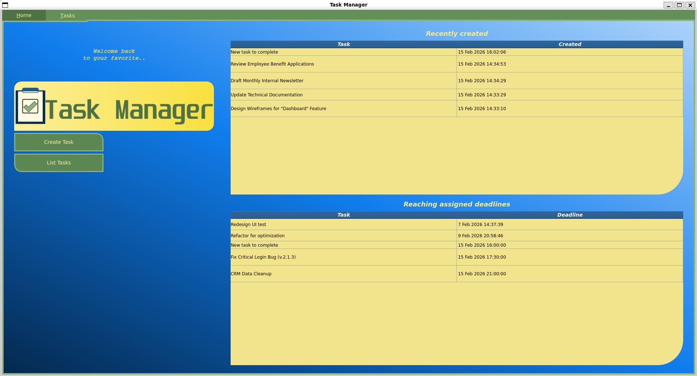
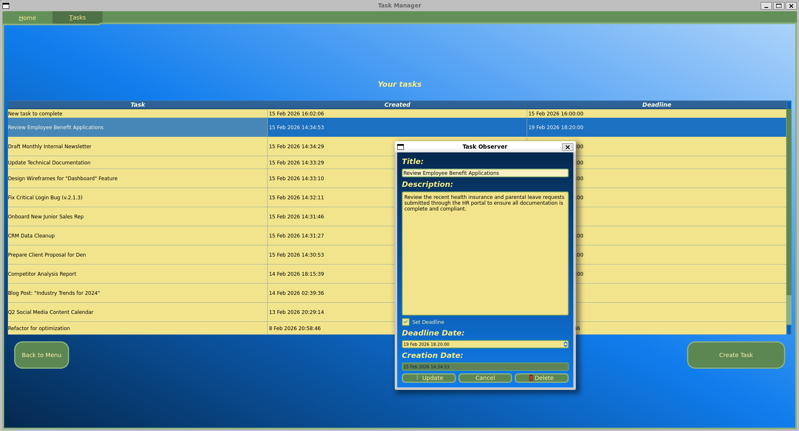
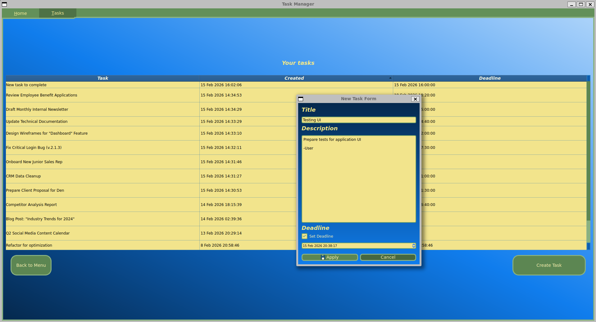

# Task Manager
Task Manager is a desktop application giving users a convenient tool for creating and editing task-notes in order to organize user's routine or professional work processes. The app provide user with opportunities to:
- Create/Delete task notes consisting of title, descrption, *optional* deadline date and auto-generated creation date;
- Edit existing task data in order to supply it with more relevant information;
- View the wished tasks by sorting the contents of the tasks table (e.g. display earlier created tasks which deadline dates are reaching the set limits). 

The program is written on C++ language with application of Qt Framework and PostgreSQL DBMS, used as a means to organize, save, collect and manipulate tasks' data. Also, SCSS metalanguage was applied to supply project with efficient tool for flexible UI customization.

# Installation and Configuration
In order to start using this app, it is necessary to accomplish the following steps:

1. Firstly, you need a relevant version of Qt5 being installed on your device;

2. Also, consider checking, whether you have the QPSQL-driver already being installed. If it has not been installed yet, you can either perform building this driver yourself, or install the package which contains the PostgreSQL plugin for Qt5, as it is shown below:
```markdown
apt install libqt5sql5-psql
``` 

3. After that check, whether you have already installed PostgreSQL. If not, you can execute the following command to do it:
```markdown
apt install postgresql
``` 

4. Next clone this repo to get the source code of this app and all of the connected to it resources:
```markdown
git clone https://github.com/wisewalker/task_manager.git
```
```markdown
git clone git@github.com:wisewalker/task_manager.git
```

5. Then create new PostgreSQL database. You can achieve it by using terminal client `psql`, like in the following example:
```markdown
psql -d *existing database name* -U *user name*
```
```sql
CREATE DATABASE *your database name*;
```

6. Finally, open the project and create new source `.cpp`-file. Name this file `globalConstants.cpp`, and place it to the path `src/globalConstants.cpp`. In this file you should enter the data needed to form a connection with your earlier created database, as it is shown in the example below:
```cpp
#include "globalConstants.h"

namespace GlobalConstants {
    extern const QString db_host_name("*host name*");
    extern const QString db_database_name("*database name*");
    extern const QString db_user_name("*user name*");
    extern const QString db_user_password("*user's password*");
}
```
7. When the configuration tasks mentioned above are finished, you can build the project and run it to observe the final result by yourself.

# Project Images
**Welcome Page**

**Tasks Management Page**

**Tasks Observer**

**New Task Form**


# Project Demo
